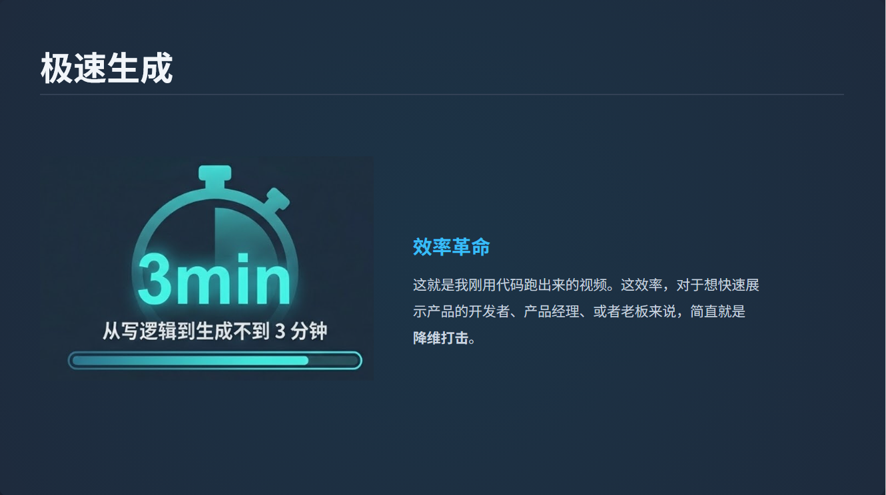

**(0-5秒 黄金开头：抛出争议)** （对着镜头，语气稍微带点“辟谣”的感觉）
最近有个叫 **Remotion** 的技术火得一塌糊涂，号称能用代码写视频。很多人问我：**“这玩意儿是不是能把剪辑师淘汰了？”** （停顿一下）
**答案是：想多了，**剪辑师很安全，但它能救程序员的命！**

**(5-20秒 揭秘原理：通俗类比)** 
其实 Remotion 没那么玄乎。它本质上就是用 HTML 和 CSS 画页面，再把页面变成动画存下来。 你就把它当成一个**“能自动播放的高级 PPT”**。 
你想让它帮你剪个 Vlog、剪个微电影？它根本做不到，也没必要。

**(20-40秒 场景痛点：它到底哪里强？)**
但是！兄弟们，如果你是做开发的，或者说你想做一个**产品演示视频**。 以前你得在 PR 里一帧一帧对轨道，累得半死。，现在用 Remotion。
比如我最近写的这个 **AI Panel** 插件（展示插件界面），我把图片、文案往代码文件夹里一扔，告诉它帮我做一个介绍产品的视频。
当然要结合remotion skill + claudecode
三分钟后，你就可以像一个老板一样检查一下claudecode做的视频怎么样了，

**(40-55秒 展示成果：爽感)** （这里一定要放那个3分钟生成的视频片段）
看！这就是我刚跑出来的视频。 **从写逻辑到生成，不到 3 分钟！** 
这效率，对于想快速展示产品的开发者、产品经理、或者老板来说，简直就是降维打击。

**(55-60秒 结尾引导)** 
所以，别指望它剪大片，但拿来做 Demo，它是真的香。

---
gpt-5.1版本
**(0-5 秒 黄金开头：争议 + 爆点)**  
最近有个叫 **Remotion** 的东西火得离谱，说是**用代码写视频**。  
很多人问我：**“这是不是要把剪辑师干掉？”**  
一句话：**剪辑师很安全，但程序员要紧张了——因为我 3 分钟就能出一条产品介绍视频。**

---

**(5-18 秒 原理解释：类比 + 降维)**  
别被吓到，其实 Remotion 本质上就是：  
用 **HTML + CSS 画页面**，再把这些页面**按时间轴动起来，导成视频**。  
就把它想成一个**会自己播放、自己切镜头的高级 PPT**。  
所以你想让它剪 vlog、剪微电影？**做不到，也没必要。**

---

**(18-38 秒 场景痛点：戳开发者)**  
但如果你是开发、独立黑客，想给自己做个**产品 Demo 视频**，它就离谱好用。  
以前你得开 PR / 剪映，一帧帧调轨道、对节奏，**折腾半天一条片**。  
现在我用 **Remotion + Claude Code**：  
把**界面截图、文案一丢进代码仓库**，让 Claude 帮我写动画逻辑，  
敲一行命令，**去倒杯水，三分钟后回来，直接像老板一样审片。**

（这句的时候展示你 AI Panel 插件和代码文件夹的画面）

---

**(38-52 秒 展示成果：爽感 + 结果)**  
比如这是我刚给自己写的 **AI Panel 插件**做的演示视频——  
**从准备素材，到写逻辑，再到导出成片，不到 3 分钟。**  
不用开 PR，不用拉时间轴，  
对开发者、产品经理、老板来说，这效率就是**降维打击**。

（这里一定放成片的精彩 3–5 秒）

---

**(52-60 秒 结尾 + 行动引导)**  
所以，**别指望它剪大片**，  
但要是你想**自动化做产品 Demo、批量生成介绍视频**，Remotion 真的香。  
后面我会把 **Remotion + Claude Code 的完整流程**拆开细讲，  
想要**源码和提示词**，在评论区扣「remotion」，  
记得点个关注，别错过后面的实战拆解。

---
融合版本

**(0-5秒 黄金开头：抛出争议)** （对着镜头，语气稍微带点“辟谣”的感觉）
最近有个叫 **Remotion** 的技术火得一塌糊涂，号称能用代码写视频。
很多人问我：**“这玩意儿是不是能把剪辑师淘汰了？”** （停顿一下）
**答案是：想多了，**剪辑师很安全，但它能救程序员的命！**

**(5-20秒 揭秘原理：通俗类比)** 
其实 Remotion 没那么玄乎。
它本质上就是前端技术画页面，再把这些页面**按时间轴动起来，导成视频**。 
你就就把它想成一个**会自己播放、自己切镜头的高级 PPT**。
你想让它帮你剪个 Vlog、剪个微电影？它根本做不到，也没必要。

**(20-40秒 场景痛点：它到底哪里强？)**
但如果你是开发、独立黑客，或者产品经理，想给自己做个**产品 Demo 视频**，它就非常好用。  
以前你得开 PR / 剪映，一帧帧调轨道、对节奏，**折腾半天一条片**。  
现在我用 **Remotion + Claude Code**：  
把**界面截图、文案一股脑丢进代码仓库**，让 Claude 帮我写动画逻辑，  
敲一行命令，**去倒杯水，三分钟后回来，直接像老板一样审片。**
（这句的时候展示你 AI Panel 插件和代码文件夹的画面）
下面我给大家展示一下我用它三分钟做出来的产品介绍短片
**(40-55秒 展示成果：爽感+ 结果)**
（这里一定要放那个3分钟生成的视频片段）
看！这就是我刚用代码跑出来的视频。 **从写逻辑到生成，不到 3 分钟！** 
这效率，对于想快速展示产品的开发者、产品经理、或者老板来说，简直就是降维打击。

**(55-60秒 结尾引导)** 
所以，**别指望它剪大片**，  
但要是你想**自动化做产品 Demo、批量生成介绍视频**，Remotion 真的香。  

开启了**“确定性视频代码化 (Deterministic Video Infrastructure)”** 的新纪元。
目前remotion最佳的使用场景集中在下面这两个

1.SaaS 产品的自动化 Release Video
2. 个性化数据报告 (Spotify Wrapped 模式)
3.
#### 1.SaaS 产品的自动化 Release Video

- **逻辑：** 每次发版（Release），GitHub Actions 触发 Claude Code。
    
- **操作：** Claude 读取 `CHANGELOG.md` -> 抓取 PR 里的截图 -> 填入 Remotion 模版 -> 自动生成一个“本周更新”视频 -> 发到 Slack/Twitter。
    
- **评价：** 完美适配。内容结构化，素材现成，不需要顶级审美。
    

#### 2. 最佳场景：个性化数据报告 (Spotify Wrapped 模式)

- **逻辑：** 你有 10 万个用户，每个人都需要一个“年度总结视频”。
    
- **操作：** 用一套 Remotion 代码，传入 JSON 数据（用户头像、使用时长、关键词）。
    
- **评价：** 只有代码能做，人工剪辑无法完成。
    

#### 3. 最佳场景：程序化 SEO 视频矩阵

- **逻辑：** 你想做 500 个视频覆盖“如何使用 Excel”、“如何使用 Word”等长尾词。
    
- **操作：** 准备 500 篇文案 + 500 组截图。让 Claude Code 循环运行，批量产出。
    
- **评价：** 这种枯燥、重复、追求数量的活，是 AI + Code 的统治区。
它最大的价值在于：**将视频内容的生产成本，从“边际成本递增”
变成了“边际成本为零”
写好代码后，生成 1 个和生成 1000 个只差电费

**

**用代码写视频**，剪辑师慌了？
最近有个叫 Remotion 的技术火得一塌糊涂，号称能用代码写视频。 很多人问我：“这玩意儿是不是能把剪辑师淘汰了？” 答案是：想多了，剪辑师很安全，但它能救程序员的命！**

其实 Remotion 没那么玄乎。 它本质上就是用 HTML 和 CSS 画页面，再把这些页面按时间轴动起来，导成视频。 你就就把它想成一个会自己播放、自己切镜头的高级 PPT。 你想让它帮你剪个 Vlog、剪个微电影？它根本做不到，也没必要。

但如果你是开发、独立黑客，或者产品经理，想给自己做个产品 Demo 视频，它就非常好用。 以前你得开 PR / 剪映，一帧帧调轨道、对节奏，折腾半天一条片。 现在我用 Remotion + Claude Code： 把界面截图、文案一股脑丢进代码仓库，让 Claude 帮我写动画逻辑， 敲一行命令，去倒杯水，三分钟后回来，直接像老板一样审片。 （这句的时候展示你 AI Panel 插件和代码文件夹的画面）

看！这就是我刚用代码跑出来的视频。 从写逻辑到生成，不到 3 分钟！ 这效率，对于想快速展示产品的开发者、产品经理、或者老板来说，简直就是降维打击。

所以，别指望它剪大片， 但要是你想自动化做产品 Demo、批量生成介绍视频，Remotion 真的香。
remotion开启了确定性视频代码化的新纪元。
它最大的价值在于：**将视频内容的生产成本，从“边际成本递增”
变成了“边际成本为零”
写好代码后，生成 1 个和生成 1000 个只差电费
